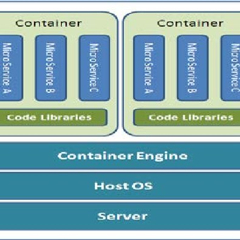
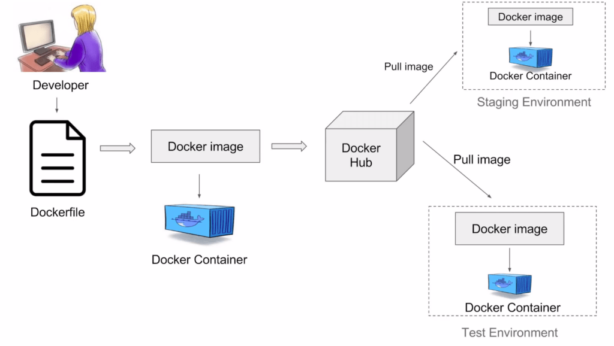
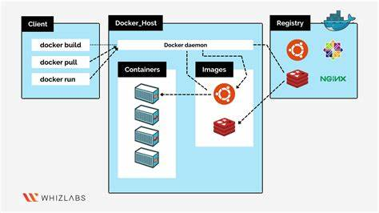

# Day 1/40 - Docker Tutorial For Beginners 🐳 - Docker Fundamentals - CKA Full Course 2024 ☸️

# Virtual Machines..

virtual machine is nothing but running the multiple operation systems in one computer or laptop is called virtual machines

In this abobe architecture it consists of Infrastructure, operating system, Hypervisior and then applications

# Drawabacks

1. It consumes lots of storage
2. It consists of heavy dependencies
3. The cost is also very high...

# Containers

A container is a lightweight, portable, and isolated environment that packages an application and all its dependencies (libraries, binaries, configuration files) so that it can run consistently across different computing environments.

# Docker Workflow

Here the Developer writes a Dockerfile by using docker build command the docker files converts into docker image by using docker push command we can push that image into dockerhub from that dockerhub pulling the image into our environment like dev, test, prod...

